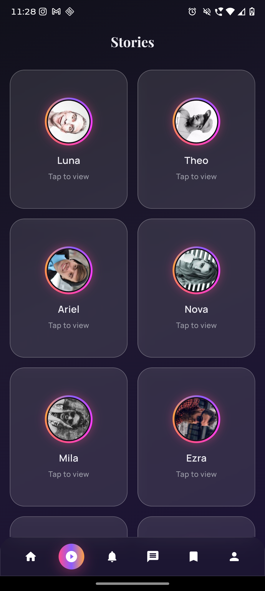

# Varsh — Instagram-Style Social UI (Flutter)

Premium, animated Instagram‑style UI built with Flutter. The focus is on **polish**, **interaction design**, and **clean architecture**, matching what most companies expect in a take‑home or UI assignment.

## Highlights

- Animated feed with story ring gradients and smooth micro‑interactions
- Swipeable post carousel + hero image transitions
- Double‑tap like with heart burst
- Glowing save button + shimmer loading states
- Glassmorphism overlays, soft gradients, rounded cards, soft shadows
- Dark mode default with light mode support

## What This Project Demonstrates (Company Expectations)

- **Clean architecture**: clear separation of models, data, state, widgets, and screens
- **State management**: `provider` with testable logic
- **Reusable components**: story widget, post card, shimmer, carousel, buttons
- **Navigation flows**: stories, profile, comments, messages, saved, share sheet
- **Production‑ready patterns**: shimmer loading, modal sheets, detail screens

## Architecture

```
lib/
  models/
  repositories/
  providers/
  services/
  widgets/
  screens/
  utils/
  main.dart
```

## Core Screens

- Home Feed
- Stories + Story Viewer
- Notifications
- Messages + Chat Detail
- Saved (All Posts / Collections)
- Profile
- Post Detail
- Comments

## Animations & Interactions

- Animated story ring gradient
- Double‑tap like + heart burst
- Swipeable image carousel
- Hero transition into image detail
- Glowing save button
- Shimmer loading placeholders

## Tech Stack

- **Flutter** (Material 3)
- **Provider** for state management
- **Google Fonts** for typography

## Run Locally

```bash
flutter pub get
flutter run
```

## Build APK

```bash
flutter build apk --debug
```

## Screenshots

Home (`home.png`)  


Stories (`stories.png`)  


Story Viewer (`story_viewer.png`)  


Notifications (`notifications.png`)  


Messages (`messages.png`)  


Chat (`chat.png`)  


Saved (`saved.png`)  


Profile (`profile.png`)  


Comments (`comments.png`)  


## Notes

- Default theme mode is **Dark**.
- Loading splash duration: ~1.4 seconds (configurable).

## Optional Enhancements

- Persist theme preference with `SharedPreferences`
- Real API integration and pagination
- Comment/like count persistence
